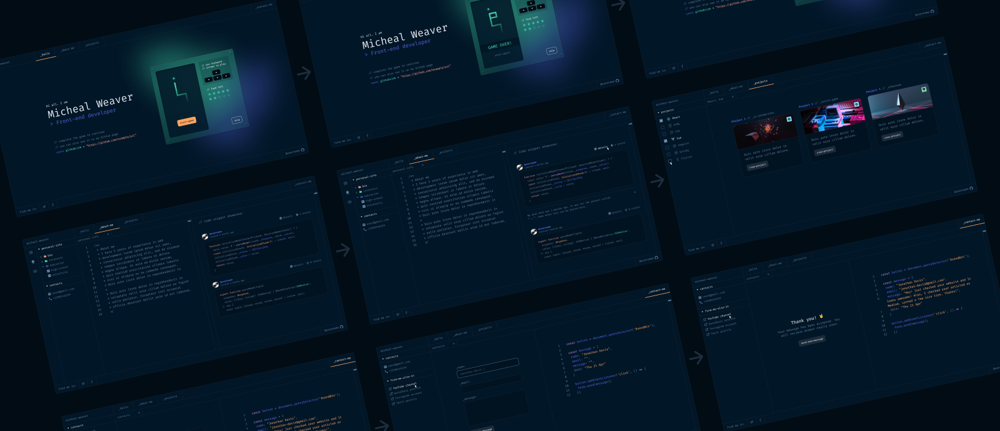

# Portfolio Website - Web/Mobile Developer



## Introduction

Welcome to my Portfolio Website! This repository showcases my skills, projects, and experiences as a Web/Mobile Developer. The website is built using React and is hosted using GitHub Pages. You can access it at [https://ramybouchareb.me/](https://ramybouchareb.me/).

## Table of Contents

- [Introduction](#introduction)
- [Features](#features)
- [Technologies](#technologies)
- [Installation](#installation)
- [Usage](#usage)
- [Projects](#projects)
- [Contact](#contact)
- [License](#license)

## Features

- Responsive design to cater to different devices (desktop, tablet, and mobile).
- Attractive and user-friendly interface.
- Detailed information about my skills and expertise.
- Showcase of various projects with descriptions and links to their repositories or live demos.
- Contact information for potential employers or collaborators.
- Links to my social media profiles and professional networks.

## Technologies

The portfolio website is built using the following technologies:

- React: A JavaScript library for building user interfaces.
- CSS3: For custom styling and design.
- GitHub Pages: For hosting the website.

## Installation

To run this website locally, follow these steps:

1. Clone this repository to your local machine:

```bash
git clone https://github.com/your-username/portfolio.git
```

2. Navigate to the project directory:

```bash
cd portfolio
```

3. Install the dependencies:

```bash
npm install
```

4. Start the development server:

```bash
npm start
```

5. Open your web browser and go to [http://localhost:3000](http://localhost:3000) to view the website.

That's it! You should now be able to see the website running locally.

## Usage

Feel free to explore the website and learn more about my skills, projects, and experiences. The website is organized into different sections to make navigation easy and intuitive.

## Projects

Here are some of the projects featured on the website:

1. [Project 1](https://github.com/RamyBouchareb25/chat-box): A chatting app made with flutter and firebase
2. [Project 2](https://github.com/RamyBouchareb25/UnityTraining): A Unity game made for training
3. [Project 3](https://github.com/RamyBouchareb25/Weather): A Weather app made with flutter

Each project has its own repository on GitHub, where you can find more details and source code.

## Contact

You can reach me via email at ramybouchareb@outlook.com or connect with me on the following platforms:

- [LinkedIn](https://www.linkedin.com/in/ramy-bouchareb-03536b227/)
- [Instagram](https://www.instagram.com/boucharebramy/)
- [Portfolio Website](https://ramybouchareb.me/)

<!--## License

This project is licensed under the [MIT License](LICENSE).
-->
Feel free to explore the code, use it as a reference, or fork it to create your own portfolio website. However, please give appropriate credit if you use any part of this project.

---

Thank you for visiting my portfolio website repository. If you have any suggestions or feedback, feel free to open an issue or contact me directly. Happy coding! 😊
